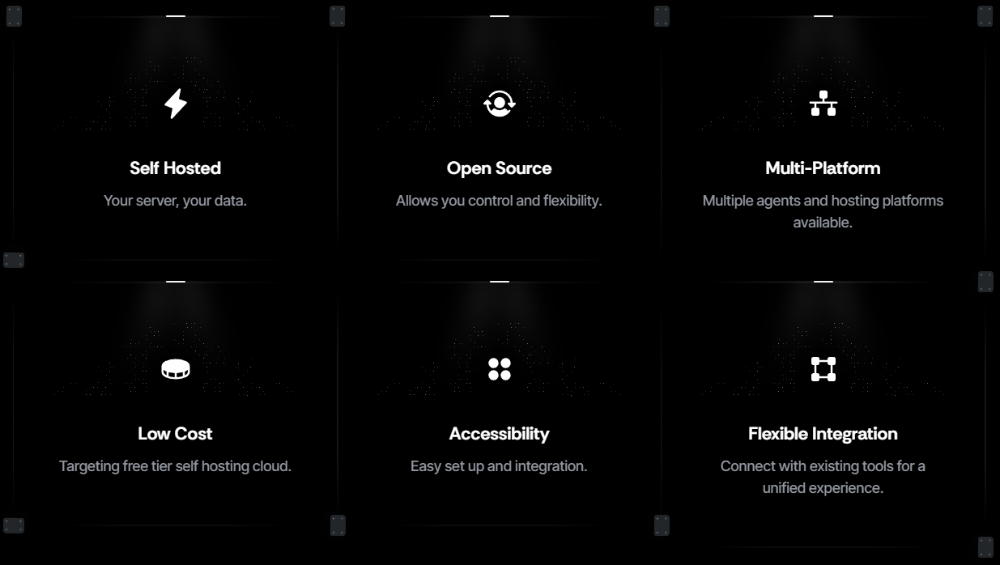

# 🎉 Solfunmeme Introduction

### SolFunMeme is your one-click "Compliance Department in a Box".

* We provide an all-encompassing system of tools to allow both tradition SaaS companies and Crypto Protocols to manage their compliance requirements in a streamlined way.&#x20;
* Our main focus in the crypto space is on enabling $Solfunmeme holders to launch sovereign self hosted technologies on their own servers, to be self dependent and secure.&#x20;
* We are agent, cloud, language and OS agnostic in the zero ontology system philosophy.

<figure><figcaption></figcaption></figure>

&#x20;
