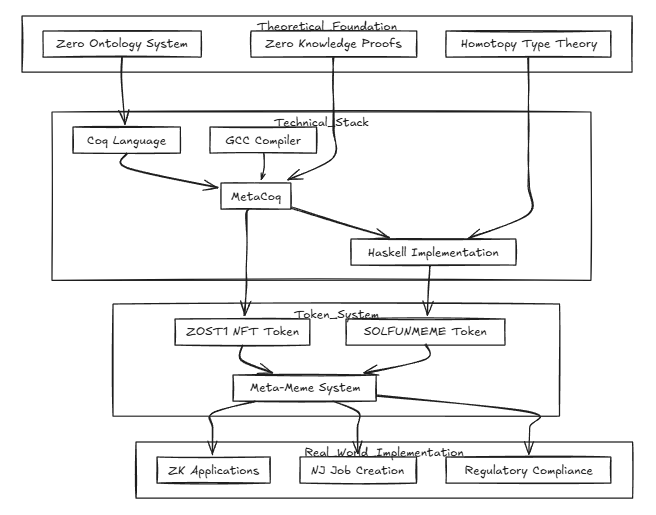

# 📜 What is $Solfunmeme?

## Solfunmeme Overview

LLC: The First AI DAO Swarm LLC

**Executive Summary:**\
This company uses AI and Zero-Knowledge Proofs (ZKP) to create a decentralized platform, "ZKPML Department in a Box," providing businesses with automated compliance, auditing, and machine learning while ensuring data privacy and regulatory adherence. An AI-mediated helper guides businesses through ZKP and AI tasks.

**Business Model & Strategy:**

* **ZKPML Department in a Box:**
  * **All-in-One Solution:** Combines ZKP for secure, private transactions and AI-driven machine learning for decision-making and auditing.
  * **AI Mediated Helper:** Offers real-time guidance on compliance, AI model optimization, and operational insights.
  * **Automated ZKP Compliance:** Ensures data privacy in AI systems while verifying outputs for regulatory compliance.
  * **Business Workflow Automation:** Automates compliance, reporting, auditing, and ML for efficiency.
* **Sharded System for Global Expansion:**
  * **Decentralized Operations:** Jurisdictions operate independently but adhere to core principles, enabling ZKP-powered DAOs globally.
  * **Collaboration and Sharing:** Shards share resources and insights, distributing profits through web services.
* **AI-Powered Decision Making:**
  * **AI Mediated Helper:** Learns from interactions to optimize models, navigate regulations, and streamline ZKP tasks.
  * **Continuous Improvement:** Evolves with data for better recommendations.

**Target Market:**

* **Startups & SMEs:** Need automated compliance and AI solutions.
* **Blockchain & Fintech Companies:** Require privacy-preserving compliance.
* **Enterprises:** Seek streamlined operations and advanced AI/ML.
* **Government and Regulators:** Need transparent, automated compliance systems.

**Technology Stack:**

* **ZKP:** For privacy-preserving compliance and auditing.
* **ML:** For compliance automation and decision-making.
* **AI Mediated Helper:** Uses NLP to guide users.
* **Blockchain:** Solana first. Expandable to other blockchains or custom protocols for governance.
* **Web Services:** APIs for ecosystem interaction.

**Revenue Streams:**

* **Subscription Model:** SaaS pricing for access to solutions.
* **Hardware Execution & Resource Access:** Specialized hardware for AI and ZKP tasks.
* **Consulting and Support Services:** Customization and setup support.
* **Web Service Fees:** Revenue from API calls and insights.

**Marketing & Sales Strategy:**

* **Developer and Community Engagement:** Open-source contributions, educational content.
* **Industry Partnerships:** With legal, financial, and blockchain firms.
* **Marketing Campaigns:** Targeted outreach, grants for development.

**Financial Projections & Funding:**

* **Revenue Streams:** Subscription, hardware access, consulting, web services.
* **Funding Requirements:** Seed for development, expansion for scaling, grants for research.

**Exit Strategy:**

* **Acquisition** by companies interested in AI, blockchain, compliance.
* **IPO** for further expansion if significant traction is achieved.

**Conclusion:**\
This model provides an innovative, secure, and compliant solution for businesses, leveraging AI and ZKP, with global scalability through a sharded system.

### Solfunmeme Visual

<figure><figcaption></figcaption></figure>
